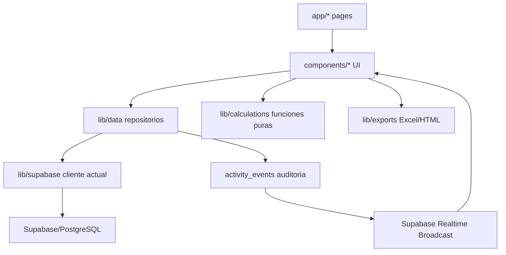

# C y P - Arquitectura y preparacion para migracion a MySQL

Este README resume como funciona actualmente la arquitectura de **C y P**, donde vive cada responsabilidad y que piezas se deben revisar antes de migrar desde Supabase/PostgreSQL hacia MySQL.

La app es un SaaS web para costos y presupuestos de construccion. El flujo principal del producto es:

```text
Recursos -> Partidas/APU -> Presupuestos -> Cronogramas -> Reportes
```

## Stack actual

- Frontend y backend web: Next.js 14 App Router.
- UI: React 18, TypeScript, Tailwind CSS y componentes propios.
- Iconos: `lucide-react`.
- Validaciones: Zod.
- Exportaciones: `xlsx` y vista HTML imprimible.
- Tests: Vitest.
- Backend actual: Supabase sobre PostgreSQL.
- Auth actual: Supabase Auth con cookies SSR mediante `@supabase/ssr`.
- Realtime actual: Supabase Realtime con Broadcast privado y Presence.
- Base local actual: Supabase CLI + Docker + migraciones SQL en `supabase/migrations/`.

## Estructura del repositorio

```text
app/                         Rutas Next.js App Router y wrappers server/client.
components/                  Componentes visuales por modulo y compartidos.
lib/calculations/            Calculos puros de APU, presupuestos, dinero y cronogramas.
lib/data/                    Capa de datos/repositorios. Encapsula Supabase.
lib/exports/                 Exportaciones Excel y HTML imprimible.
lib/mock-data/               Datos mock temporales o de soporte.
lib/realtime/                Broadcast, Presence y payloads colaborativos.
lib/search/                  Busqueda global navegable.
lib/supabase/                Configuracion y clientes Supabase browser/server.
lib/validations/             Schemas Zod y helpers de formularios.
types/domain.ts              Tipos de dominio usados por la UI.
supabase/migrations/         Fuente de verdad del esquema PostgreSQL actual.
supabase/seed.sql            Datos demo locales.
supabase/tests/rls.sql       Pruebas pgTAP de seguridad/RLS.
docs/                        Documentacion extensa del producto y arquitectura.
middleware.ts                Proteccion de rutas y resolucion basica de sesion.
```

## Flujo de capas

La regla central es que la UI no debe hablar directo con la base ni contener logica financiera. Las pantallas consumen repositorios y hooks; los repositorios llaman a Supabase; los calculos viven en funciones puras.



## Rutas principales

- `/`: dashboard persistente con proyectos y presupuestos vigentes.
- `/login`, `/registro`, `/recuperar-clave`, `/actualizar-clave`: autenticacion.
- `/onboarding`: alta inicial de perfil/organizacion.
- `/proveedores`: CRUD persistente de proveedores.
- `/recursos`: CRUD persistente de recursos, historial y cotizaciones.
- `/partidas`: CRUD persistente de partidas/APU.
- `/partidas/[id]`: detalle y builder APU persistente.
- `/presupuestos`: workspace persistente del borrador activo.
- `/presupuestos/[proyectoId]`: presupuesto por proyecto.
- `/cronogramas`: modulo mock/frontend, pendiente de persistencia.
- `/reportes`: reportes MVP sobre datos persistentes.
- `/configuracion/organizaciones`: organizaciones, invitaciones y permisos.
- `/configuracion/proyecto`: configuracion de proyecto.

`middleware.ts` protege estas rutas usando Supabase Auth. Si no hay sesion redirige a `/login`; si el usuario no tiene membresia activa redirige a `/onboarding`.

## Capa de datos

La capa clave para una migracion es `lib/data/`. Ahi estan los contratos que hoy acoplan el producto a Supabase, pero tambien son el punto natural para insertar un adaptador MySQL.

Archivos principales:

- `lib/data/contracts.ts`: contratos neutrales de la capa de datos (`DataScope`, `DataResult`, errores, auditoria y conflictos optimistas). No importa Supabase y debe mantenerse estable durante la migracion.
- `lib/data/types.ts`: define `DataClient`, `DataScope`, `DataResult`, `DataError`, conflictos optimistas y auditoria.
- `lib/data/scope.ts`: valida que exista `organizacionId` y, en mutaciones, `actorId`.
- `lib/data/workspace.ts`: resuelve usuario, organizaciones, proyectos, roles y scope activo.
- `lib/data/providers.ts`: proveedores.
- `lib/data/resources.ts`: recursos e historial.
- `lib/data/quotes.ts`: cotizaciones multi-proveedor.
- `lib/data/items.ts`: partidas/APU y recursos de partida.
- `lib/data/partida-catalogs.ts`: categorias, subcategorias y unidades.
- `lib/data/budgets.ts` y `lib/data/budgets/*`: fachada y submodulos de presupuestos.
- `lib/data/projects.ts`: proyectos.
- `lib/data/organizations.ts`: organizaciones, invitaciones y permisos.
- `lib/data/activity.ts`: actividad reciente.
- `lib/data/reports.ts`: agregaciones de reportes.

Contrato actual simplificado:

```ts
type DataScope = {
  actorId?: string;
  organizacionId: string;
  proyectoId?: string;
};

type DataResult<T> =
  | { ok: true; data: T }
  | { ok: false; error: DataError };
```

Para MySQL conviene conservar estos contratos publicos y reemplazar la implementacion interna. Eso reduce cambios en `app/` y `components/`.

Estado Fase 1:

- Los contratos compartidos viven en `lib/data/contracts.ts` y ya no dependen de `@supabase/supabase-js` ni de los tipos generados desde PostgreSQL.
- `lib/data/types.ts` queda como archivo de compatibilidad para imports existentes. Reexporta los contratos neutrales y conserva `DataClient = SupabaseClient<Database>` mientras Supabase siga siendo la implementacion actual.
- `JsonRecord` sigue dependiendo de `lib/supabase/types.ts` porque representa JSON tipado generado desde Supabase; debe reemplazarse o moverse cuando exista un adaptador MySQL real.
- Las firmas publicas de los repositorios `lib/data/*` se mantienen sin cambios para no romper pantallas.

Estado Fase 1.5:

- `/proveedores` ya no consulta `recursos` directamente con `.from("recursos")` para armar metricas y conteos de proveedores. Esa lectura vive en `listProviderLinkedResources` dentro de `lib/data/providers.ts`.
- Supabase sigue siendo la implementacion interna actual de `lib/data/providers.ts`.
- Auth, middleware, Realtime y migraciones Supabase no se tocaron.

Estado Fase 1.6:

- `/proveedores` ya no importa `createBrowserClient` desde `lib/supabase/browser`.
- La creacion del cliente browser pasa por `createDataBrowserClient` en `lib/data/browser-client.ts`.
- `createDataBrowserClient` sigue usando Supabase internamente; esta fase solo oculta esa dependencia en la UI y no cambia la base de datos ni el comportamiento de los repositorios.
- El resto de pantallas todavia puede importar el cliente Supabase directo hasta que se migren de forma incremental.

Estado Fase 1.7:

- `/recursos` ya no importa `createBrowserClient` desde `lib/supabase/browser`.
- La pantalla de recursos usa `createDataBrowserClient` para pasar el cliente actual a las fachadas de `lib/data`.
- No se movieron queries porque las lecturas/escrituras de recursos, proveedores auxiliares, cotizaciones, historial y catalogos ya pasan por `lib/data`.
- Supabase sigue siendo la implementacion interna actual; Auth, middleware, Realtime, Storage y migraciones no se tocaron.

Estado Fase 1.8:

- `/partidas` y `/partidas/[id]` ya no importan `createBrowserClient` desde `lib/supabase/browser`.
- Ambas pantallas usan `createDataBrowserClient` para pasar el cliente actual a las fachadas de `lib/data`.
- No se movieron queries ni logica APU porque las lecturas/escrituras de partidas, recursos APU, catalogos y recursos ya viven en `lib/data/items.ts`, `lib/data/partida-catalogs.ts` y repositorios relacionados.
- La logica de sincronizacion de recursos APU en la pantalla de listado sigue siendo deuda tecnica controlada para una fase posterior; no se movio para evitar cambiar comportamiento.
- Supabase sigue siendo la implementacion interna actual; Auth, middleware, Realtime, Storage, presupuestos y migraciones no se tocaron.

## Modelo funcional actual

### Multi-organizacion y permisos

El modelo de permisos gira alrededor de:

- `organizaciones`
- `organizacion_miembros`
- `user_profiles`
- `proyectos`
- `proyecto_miembros`
- `organizacion_invitaciones`

Roles conceptuales:

- Organizacion: `owner`, `admin`, `miembro`.
- Proyecto: `admin`, `presupuestador`, `editor`, `lector`.

En PostgreSQL, gran parte de la seguridad vive en RLS y funciones `security definer`. En MySQL esto debe pasar a la capa backend/API, porque MySQL no tiene una equivalencia directa de RLS como la usada por Supabase.

### Catalogo operativo

Tablas principales:

- `proveedores`
- `recursos`
- `recurso_proveedor_precios`
- `recurso_precios_historial`
- `partidas`
- `partida_recursos`
- `partida_categorias`
- `partida_subcategorias`
- `unidades_medida`

Regla importante: `recursos` es catalogo canonico. No se duplica un recurso por proveedor; los precios por proveedor viven en `recurso_proveedor_precios`.

### Presupuestos

El sistema separa borrador vivo y versiones oficiales:

- `presupuesto_borradores`: cabecera editable del borrador colaborativo.
- `presupuesto_borrador_partidas`: lineas vivas del borrador.
- `presupuesto_borrador_partida_recursos`: snapshot vivo de recursos APU.
- `presupuesto_versiones`: cabecera oficial congelada.
- `presupuesto_version_partidas`: lineas oficiales congeladas.
- `presupuesto_version_partida_recursos`: recursos oficiales congelados.

Reglas clave:

- Un proyecto debe tener maximo un borrador activo.
- El borrador puede recalcular con precios actuales.
- Las versiones oficiales son inmutables desde cliente.
- Al emitir version oficial se congelan cabecera, partidas, recursos, precios internos y precios cliente.
- Los cambios usan `updated_at` para detectar conflictos optimistas.

### Auditoria y colaboracion

`activity_events` es la auditoria permanente. Supabase Realtime solo transporta avisos efimeros.

Flujo actual:

1. Una mutacion escribe datos reales.
2. La misma mutacion registra `activity_events`.
3. Un trigger PostgreSQL emite Broadcast privado.
4. La UI recibe el evento y hace refetch o parche local.

Para MySQL hay que reemplazar Supabase Realtime por otra pieza: WebSocket propio, SSE, Pusher, Ably, Socket.IO, Redis Pub/Sub o similar.

## Dependencias fuertes de Supabase/PostgreSQL

Estas son las piezas que no migran directamente a MySQL:

- Cliente `@supabase/supabase-js` y `@supabase/ssr`.
- Supabase Auth (`supabase.auth.getUser`, cookies SSR, OAuth, recuperacion de clave).
- RLS y policies SQL.
- Funciones `security definer`.
- RPCs llamadas con `client.rpc(...)`.
- `auth.uid()` dentro de SQL.
- `realtime.messages`, Broadcast y Presence de Supabase.
- Triggers que llaman `realtime.send(...)`.
- Tipos generados en `lib/supabase/types.ts`.
- Enums PostgreSQL creados con `create type`.
- `uuid` con `gen_random_uuid()`.
- `jsonb`.
- Indices parciales, por ejemplo para un unico borrador activo.
- Expresiones y operadores PostgreSQL usados en policies o funciones.
- Tests pgTAP de `supabase/tests/rls.sql`.

## RPCs actuales a reemplazar

La busqueda `client.rpc(...)` muestra funciones criticas que hoy viven en PostgreSQL:

- `list_workspace_organizations`
- `complete_user_onboarding`
- `create_organization_for_current_user`
- `create_organization_invitation`
- `regenerate_organization_invitation_token`
- `list_sent_organization_invitations`
- `list_received_organization_invitations`
- `list_organization_invitation_notifications`
- `list_organization_member_permissions`
- `update_organization_member_permissions`
- `accept_organization_invitation`
- `accept_organization_invitation_by_id`
- `reject_organization_invitation`
- `revoke_organization_invitation`
- `list_budget_dashboard_projects`
- `add_draft_partida`
- `refresh_draft_current_prices`
- `refresh_draft_current_prices_for_resources`
- `recalculate_budget_draft_totals`
- `emit_official_budget_version`
- `delete_provider_for_current_user`

En MySQL estas operaciones deberian implementarse como servicios transaccionales del backend. Pueden ser API Routes de Next.js, Server Actions, un servidor Node separado o stored procedures MySQL, pero la recomendacion para mantener portabilidad es mover la regla de negocio transaccional a TypeScript del lado servidor y dejar SQL para persistencia.

## Mapa PostgreSQL -> MySQL

| PostgreSQL/Supabase actual | En MySQL recomendado |
| --- | --- |
| `uuid default gen_random_uuid()` | `char(36)` con UUID generado por backend o `binary(16)` optimizado |
| `jsonb` | `json` |
| `timestamptz` | `datetime(3)`/`timestamp` en UTC |
| `numeric(12,2)` | `decimal(12,2)` |
| `create type ... enum` | `enum(...)` MySQL o `varchar` + checks/validacion app |
| RLS policies | Autorizacion en API/backend por `actorId`, organizacion y proyecto |
| `auth.uid()` | Usuario resuelto por sesion/JWT en backend |
| `security definer` RPC | Servicio backend transaccional |
| `realtime.send` | WebSocket/SSE/servicio externo |
| Indice unico parcial | Columna generada o indice unico compuesto con estado normalizado |
| `updated_at` trigger | Trigger MySQL o actualizacion controlada en backend |
| pgTAP RLS tests | Tests de servicios/autorizacion y migraciones |

## Estrategia recomendada de migracion a MySQL

### 1. Congelar contratos antes de tocar base

Mantener estables:

- Tipos de dominio en `types/domain.ts`.
- Resultados `DataResult<T>`.
- Scope `DataScope`.
- Funciones puras de `lib/calculations/`.
- Schemas Zod de `lib/validations/`.
- Exportaciones en `lib/exports/`.

Objetivo: que la UI siga llamando a `lib/data/*` aunque por debajo cambie el motor.

### 2. Introducir una frontera backend real

Hoy parte de la seguridad y transacciones vive en Supabase/Postgres. Con MySQL hace falta una frontera server-side obligatoria.

Opciones viables:

- Next.js Route Handlers en `app/api/*`.
- Server Actions si se decide estandarizar ese patron.
- Backend Node separado.

Responsabilidades de esa frontera:

- Leer sesion/JWT.
- Resolver `actorId`.
- Validar organizacion/proyecto.
- Aplicar permisos equivalentes a RLS.
- Ejecutar transacciones.
- Registrar auditoria.
- Emitir eventos realtime.

### 3. Crear adaptadores de datos

Separar contratos de implementacion:

```text
lib/data/
  contracts.ts
  providers.ts            fachada publica
  adapters/
    supabase/
    mysql/
```

Mientras dure la migracion, se puede mantener Supabase y MySQL en paralelo por modulo. Por ejemplo:

1. Migrar solo lectura de proveedores.
2. Migrar escritura de proveedores con auditoria.
3. Migrar recursos/cotizaciones.
4. Migrar partidas/APU.
5. Migrar presupuestos y RPCs transaccionales.
6. Migrar organizaciones/auth/realtime.

### 4. Portar esquema por dominios

Orden sugerido:

1. Tablas base: organizaciones, miembros, proyectos, perfiles.
2. Catalogos: proveedores, recursos, cotizaciones, historial.
3. Partidas/APU.
4. Presupuestos legacy si aun se necesita compatibilidad.
5. Borradores y versiones oficiales.
6. Auditoria `activity_events`.
7. Cronogramas persistentes si se aprovecha la migracion para implementarlos.

### 5. Reimplementar transacciones criticas

Prioridad alta:

- Crear organizacion/onboarding.
- Crear proyecto con membresia y auditoria.
- Agregar partida al borrador.
- Recalcular totales de borrador.
- Refrescar precios vigentes.
- Emitir version oficial congelada.
- Actualizar permisos de miembros.
- Aceptar/rechazar/revocar invitaciones.

Estas operaciones deben usar transacciones MySQL (`START TRANSACTION`, `COMMIT`, `ROLLBACK`) o el mecanismo transaccional del ORM/query builder elegido.

### 6. Reemplazar Auth y permisos

Decision pendiente:

- Mantener Supabase Auth y migrar solo la base de negocio a MySQL.
- Migrar Auth a NextAuth/Auth.js, Clerk, Auth0, Cognito u otro proveedor.
- Construir auth propia, solo si hay una razon fuerte.

Si se mantiene Supabase Auth sin Supabase DB, el backend MySQL debe validar JWTs de Supabase y mapear `sub` a `user_profiles.id`.

### 7. Reemplazar Realtime

Supabase Realtime debe ser reemplazado por:

- SSE para actividad simple y notificaciones.
- WebSocket/Socket.IO para Presence y edicion colaborativa.
- Servicio externo como Pusher/Ably si se quiere evitar operar infraestructura.
- Redis Pub/Sub si hay multiples instancias backend.

La regla no cambia: realtime es aviso efimero, `activity_events` y las tablas de negocio son la fuente confiable.

### 8. Migrar datos

Flujo recomendado:

1. Exportar schema PostgreSQL actual.
2. Crear schema MySQL versionado.
3. Exportar datos en orden por foreign keys.
4. Transformar tipos (`uuid`, `jsonb`, enums, fechas).
5. Importar a MySQL.
6. Correr verificaciones de conteo y totales.
7. Comparar presupuestos oficiales contra snapshots originales.
8. Ejecutar pruebas de servicios y exportaciones.

## Riesgos principales

- Perder seguridad al quitar RLS sin reemplazarla en backend.
- Reimplementar mal las RPCs transaccionales de presupuestos.
- Romper snapshots oficiales congelados durante conversion de tipos.
- Cambiar precision monetaria si se usan `float` en vez de `decimal`.
- Perder eventos de auditoria si las mutaciones no escriben `activity_events`.
- Duplicar formulas financieras fuera de `lib/calculations/`.
- Conectar componentes directamente a MySQL/API y saltarse `lib/data/`.
- Subestimar Realtime/Presence: no es solo UI, tambien depende de autorizacion por canal.

## Checklist antes de iniciar la migracion

- [ ] Decidir proveedor de Auth.
- [ ] Decidir ORM/query builder o SQL directo para MySQL.
- [ ] Definir si Next.js sera tambien backend definitivo.
- [ ] Congelar contratos publicos de `lib/data/*`.
- [ ] Documentar todas las RPCs actuales y su equivalente server-side.
- [ ] Convertir migraciones PostgreSQL a migraciones MySQL versionadas.
- [ ] Crear tests de autorizacion que sustituyan RLS/pgTAP.
- [ ] Crear tests de transacciones para presupuestos.
- [ ] Crear script de export/import con validaciones de conteo.
- [ ] Validar precision de todos los campos monetarios con `decimal`.
- [ ] Definir reemplazo de Broadcast/Presence.
- [ ] Mantener snapshots oficiales inmutables despues de importar.

## Comandos actuales utiles

```powershell
pnpm install
pnpm dev
pnpm test
pnpm lint
pnpm build
pnpm exec tsc --noEmit
pnpm run supabase:start
pnpm run supabase:stop
pnpm run supabase:status
pnpm run supabase:reset
pnpm run supabase:migrate
pnpm run supabase:types
```

Durante la migracion, los comandos Supabase dejaran de ser la fuente de verdad cuando exista una carpeta nueva de migraciones MySQL. Hasta entonces, `supabase/migrations/` sigue siendo el mapa mas fiel del modelo actual.

## Documentacion relacionada

- `docs/01-arquitectura.md`: arquitectura actual completa.
- `docs/02-modelo-datos.md`: modelo de datos y reglas persistentes.
- `docs/03-calculos.md`: formulas de APU, presupuestos y cronogramas.
- `docs/06-validaciones-y-testing.md`: validaciones y pruebas.
- `docs/08-produccion.md`: preparacion productiva.
- `docs/09-avances-y-goals.md`: estado vivo del MVP.
